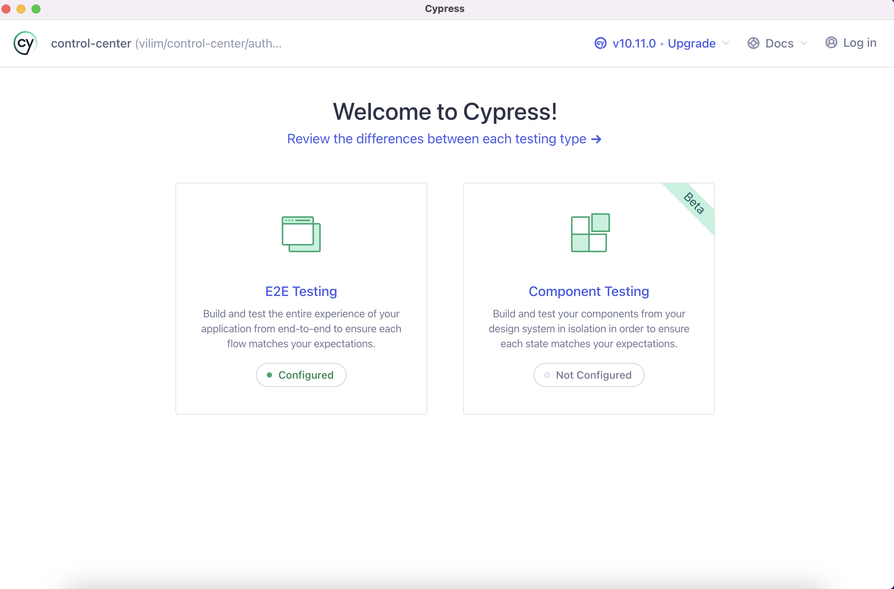
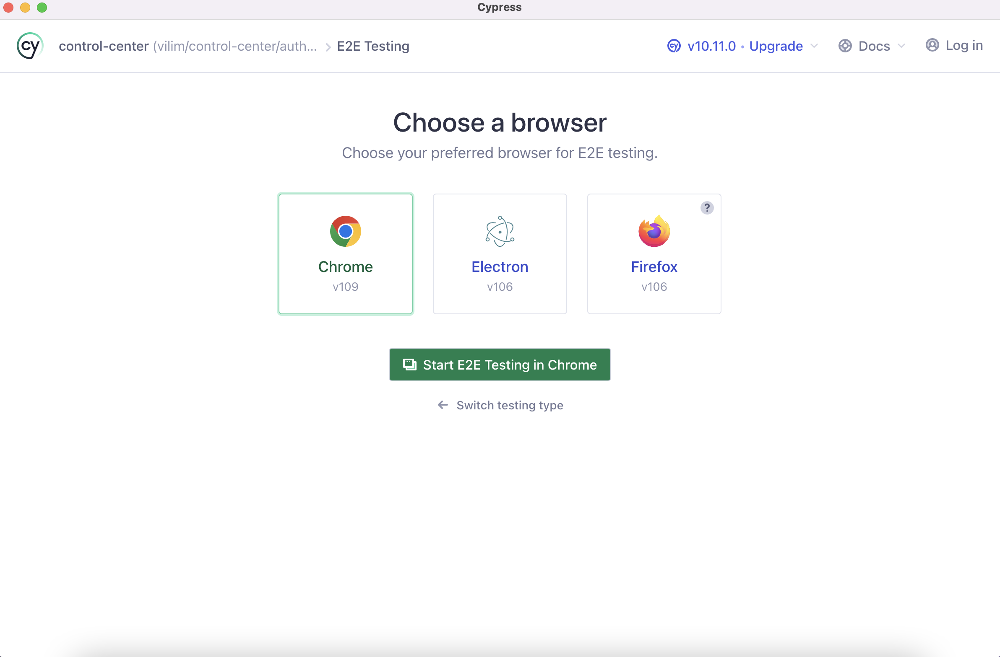
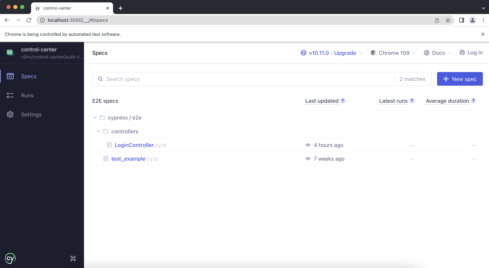
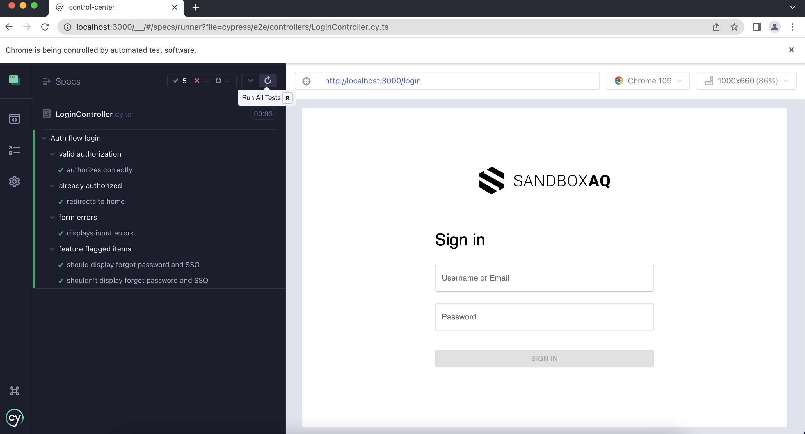

# Control Center

This is React SPA (Single Page Application) is the front-end for the different microservices offered in the Quantum Security Group in SandboxAQ (e.g. Benchmark, Analyzer). The goal of this Web App is to allow users to get insights and action on their system's security and cryptography.

## Design

This Web-App is in the process of migrating pages from an old Flask app. For more information about the migration see:

- [Generic migration doc](https://docs.google.com/document/d/114np4T88K3Azg2MrK3kbAX2V3IZiSYm1MyFeeo1v4_c/edit?usp=sharing)
- [Authentication + routing](https://docs.google.com/document/d/1vHEkrCJvG0aOjmsFNaij6pIB527CRcmWEw_08XrNnhU/edit#)

## Pre-requisites

- [Yarn](https://classic.yarnpkg.com/lang/en/docs/install/#mac-stable)
- [Bazel](https://docs.docker.com/get-docker/)
- Must run the legacy Cryptosense front-end prior, see [`README`](https://github.com/sandbox-quantum/chungus/blob/main/cs/web-findings/README.md)

## Dependency management

Dependencies should be added using `pnpm` rather than `npm`. This is in order to add the dependencies to the top level `package.json` with Bazel.

Use this command, run at the `chungus/` level or ensure the path is pointing to the correct directory:

```
bazelisk run @pnpm//:pnpm -- --dir $PWD/saq/common/build/javascript add XXXX
```

To continue supporting Yarn builds, `chungus/saq/pqc/control-center/package.json` needs to be maintained, to update this file as well as other local `package.json`'s run from `chungus/`:

```
./saq/common/build/javascript/update-package-jsons.sh
```

Add the dependency to the `chungus/saq/pqc/control-center/BUILD.bazel` DEPENDENCIES constant.

## Environment variables

Control Center requires some environment variables to be set before running or building.
The required environment variables are outlined in `.env_sample`.

Before running or building, copy `.env_sample` to `.env` and set the appropriate values.

`.env` should look like this:

```
LAUNCHDARKLY_CLIENT_SIDE_ID=<your_launchdarkly_client_sdk_key>
```

## Install, run and build

It is possible to run and build the app using Yarn and Bazel. Bazel should be preferred whenever possible.

Running the app serves it at `http://127.0.0.1:3000`, and communication with the Cryptosense API is handled by webpack request proxying.
Only React pages will be available: navigating to a page that has not been migrated to React will render a blank screen.

This usage is especially useful to quickly develop and test changes to new pages and features.

Building the app creates static files that will be served by the Cryptosense frontend itself at `http://127.0.0.1:5000`.
All pages (legacy and React) will be available.

It is considered a good practice to always test new developments and fixes through Cryptosense after a static build to make sure everything works when deployed and not only locally (e.g. navigation from React and legacy pages and viceversa).

### Optimizing Bazel

For faster Bazel executions, create a new file at `chungus/dev/user.bazelrc` (in .gitignore) and copy the contents of `template-user.bazelrc`.

### Development with Bazel (recommended)

Make sure the environment variables are set in `.env` ([here](#environment-variables))
Bazel does not natively support hot reload of code changes during development: installation of [`ibazel`](https://github.com/bazelbuild/bazel-watcher) is required.

Run the following command to serve Control Center at `http://127.0.0.1:3000`

`ibazel run //saq/pqc/control-center:start-dev`

In case of failure due to stale cached files or any other reason, the Bazel cache can be cleaned with `bazel clean` and the command can be executed again.

### Development with Yarn/NPM (deprecated)

Make sure the environment variables are set in `.env` ([here](#environment-variables))
Yarn natively supports hot reload of code changes during development. You will see the build errors and lint warnings in the console.

Run `yarn start` or `npm run start`

### Building with Bazel (recommended)

Make sure the environment variables are set in `.env` ([here](#environment-variables))

Run `bazel build //saq/pqc/control-center:build-dev`

Built files will be stored under `chungus/bazel-bin/saq/pqc/control-center/out/dev`: the absolute path of this folder should be set as `CONTROL_CENTER_BUILD_DIR` in `cs/web-findings/.env`

### Building with Yarn/NPM (deprecated)

Make sure the environment variables are set in `.env` ([here](#environment-variables))

Run `yarn build` or `npm run build`

Built files will be stored under `chungus/bazel-bin/saq/pqc/control-center/dist`: the absolute path of this folder should be set as `CONTROL_CENTER_BUILD_DIR` in `cs/web-findings/.env`

## Testing

### Cypress

Cypress is used for E2E integration testing. Tests will be run as part of the CI/CD pipeline and can also be run manually follows:

```
bazel run //saq/pqc/control-center/cypress:e2e/test_example.cy
```

This command will start React application with `webpack.test.js` with `test` environment setup.
The key difference from `dev` or `production` is that redirections to backend will be captured with
`BlankViewController` and won't be redirected to `{BACKEND_URI}/path` since we don't have an active
backend app that can handle this redirection.
From the webpack perspective, `test` is equal to the `dev` environment.

Additional tests can be run with following template:

```
bazel run //saq/pqc/control-center/cypress:e2e/{test-path}
```

For example:

```
bazel run //saq/pqc/control-center/cypress:e2e/controllers/LoginController.cy
```

_Note: don't link to `cy.ts` files. These are considered source files and aren't runnable in the
test context._

#### Writing tests

To write tests, it is tedious having to rerun the whole process building and waiting for the webpack build.

Easier setup is to run the following commands:

```
bazel run //saq/pqc/control-center:start-test

yarn cypress open -C cypress/cypress.config.ts
```

First command will start the dev server in `test` environment, where previously explained routing difference
happens. Since the basis of this environment is `dev` mode, any change will be quickly recompiled and available
in tests.

The app itself will be available on `http://127.0.0.1:3000`, which is also set as a base url in the cypress config.

Second command will open the cypress GUI where you can quickly rerun all or specific tests.






This is the **_recommended dev flow_** while writing tests since you get the flexibility
of quick updates, visual inspection and ability to log and debug both tests and the code itself.

### Jest

Jest is used for unit testing. Tests will be run as part of the CI/CD pipeline and can also be run manually

- with Yarn: `yarn test`
- with Bazel: `bazel test //saq/pqc/control-center:run-test`
