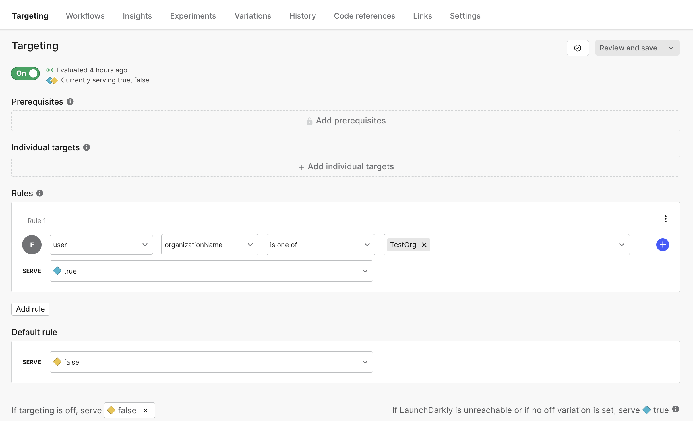

# Feature Flags

In Control Center and Cryptosense we use Launch Darkly for feature management. For extensive details on the platform, see official [Launch Darkly documentation](https://docs.launchdarkly.com/home).

## Developer Setup

1. Contact Lucia to be invited to the platform.
2. Create an local environment for yourself [here](https://app.launchdarkly.com/settings/projects/default/environments/new), use naming pattern: `[name]-local`.
3. Find your server side and client side SDK keys [here](https://app.launchdarkly.com/settings/projects/default/environments).
4. Add your local server side SDK key to your `cs/web-findinds/.env`.
5. Add your local client side SDK key to your `saq/pqc/control-center/.env`.
6. Your local instance of Cryptosense should now be connected to your Launch Darkly local environment flags.

## Environments

We have 3 shared team environments:

* *Production:* For the time being, Lucia will handle production flag flips, ensuring that UX + PM approvals are cleared. Features will be enabled in the SandboxAQ production instance before enabling to other clients.

Access here: [https://analyzer.cryptosense.com/](https://analyzer.cryptosense.com/). If you do not have an account, ask Bertrand to invite you.

* *Staging:* Staging flags can be flipped without approvals. Having said this, be cautious that this environment will be used by many people, so we should not enable broken features. Bug bashes should be run in the staging environment.

Access here: [https://analyzer.dev.cs.sbt-infra.net/](https://analyzer.dev.cs.sbt-infra.net/)

* *Testing:* Avoid using this environment, cryptosense integration tests get run on this environment and certain flag flips may break these tests. Eventually, this environment will be linked to a Testing deployment that is separate from integration test which can be used for enabling and showcasing features prematurely.

Additionally, local environments can be created for individuals to control their feature flags for local development, see [Developer Setup](#developer-setup) instructions for enabling this.

## Targeting

In Control Center and Cryptosense, when flag requests are made to Launch Darkly we send a context which can be used to do flag targeting. The information that is getting sent over is the following:

* key: `user.id`
* name: `user.name`
* organizationName: `user.organization.name`
* organizationId: `user.organization_id`

In order to target a certain organization or user:

1. Navigate to the desired feature flag `Targeting` page
2. Populate either an `Individual target` or a `Rule` with the desired value to serve.
  * `Individual Targets` are used to target a specific user ID
  * `Rules` are used to target using other attributes (e.g. user name, organization name or organization ID)
3. Ensure that the `Default value` and the `If targeting is off, serve` sections are properly filled out with the value you want other users to see (for most cases both should be `false`).
4. Once you have filled all of the above, flip the toggle below the `Targeting` header.

See example below:

## Creating a new flag

When creating a new flag, ensure the following:

1. You are using the naming pattern: `Enable[FeatureName]` (e.g. EnableMyFeature).
2. Ensure a clear description is added.
3. If the flag is going to be used in the Control Center, ensure `SDKs using Client-side ID` is enabled.

## Implementation Details

### Cryptosense

Launch Darkly is implemented with a feature flag wrapper: `cs/web-findings/app/models/feature_flags.py`. All flags be defined in the code base and will be evaluated with the order of preference:

* If Launch Darkly SDK is defined and Launch Darkly is configured, request and use Launch Darkly flag.
* Else if, the flag has been defined as an environment variable, use that value.
* Else, use the default hardcoded value.

The idea of this abstraction is to make it easy for developers to use feature flags via Launch Darkly or environment variables.

### Control Center

Launch Darkly is implemented with a feature flag wrapper: `saq/pqc/control-center/src/utils/FeatureFlags`. Similarly to the server side implementation, Launch Darkly flags will have the highest priority. If Launch Darkly is not available, client default values will be used instead.
