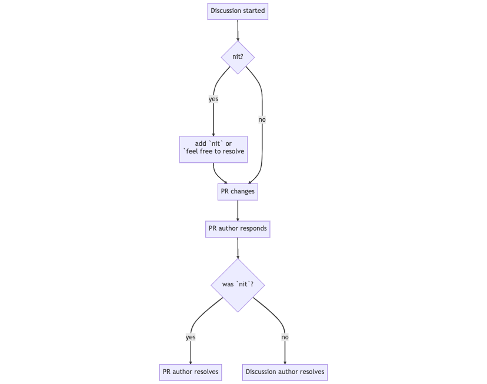

# Best Practices

In the Control Center we are following Airbnb's style guide:

- [Javascript](https://github.com/airbnb/javascript)
- [React](https://github.com/airbnb/javascript/tree/master/react)

When sending a PR, please ensure the following:

- Included a descriptive title and description
- Included screenshots if there are visible changes
- Ensured that the number of lines of code in this PR is reasonable and scope is limited to accomplishing a single thing
- Updated [internal docs](https://chungus.sbt-infra.net/) (if necessary)

During PR discussions, follow this decision flowchart:

Discussion author should always resolve their own discussion, unless the discussion is marked as a low priority or
not important.

We consider `nit` as an indicator that the PR author is free to resolve the discussion on their own.
