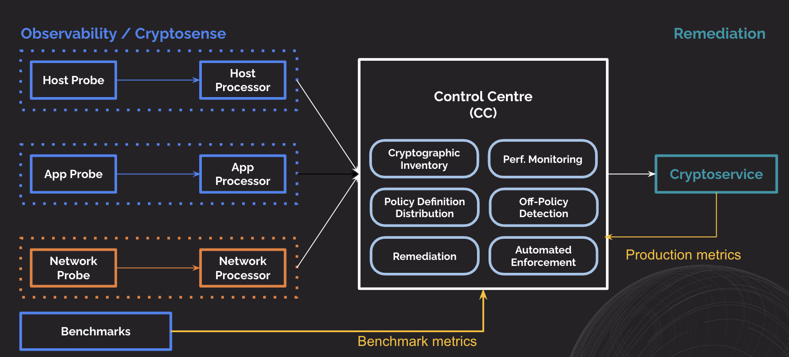

# Control Center

Control Center is the front-end for the different microservices offered in the Quantum Security Group in SandboxAQ (e.g. Benchmark, Analyzer). The goal of this Web App is to allow users to get insights and action on their system's security and cryptography.

High level QSG (Quantum Security Group) architecture:

If you are new to the team please check out the [onboarding](onboarding.md) page.

For technical documentation, refer to the [development](technical-documentation/intro.md) page.

## Team Values

### Vision
Demystify cryptography.

### Mission
Empower organizations to monitor, understand and protect their cryptography by creating a one-stop gateway for QSG modules.

### Guiding Principles
*Inclusion:* Create a supportive space for everyone to thrive and let every voice be heard.

*Growth:* Foster a collaborative and growth-oriented culture through feedback, communication, and a learning mindset.

*Fluidity, be like water:* Efficient and customer-focused software development with scalable, tested code and minimal tech debt.

*Simplicity:* Provide a user-friendly and trustworthy platform through an intuitive interface and effective data visualization.

## Quick Links

The following are Control Center specific links:

- Codebase ([go/cc](https://go/cc))
- Drive ([go/cc-drive](https://go/cc-drive))
- Asana ([go/cc-asana](https://go/cc-asana))
- Figma ([go/cc-figma](https://go/cc-figma))
- Product ([go/cc-coda](https://go/cc-coda))
- Bug / Feature Request ([go/cc-bug](https://go/cc-bug), [go/cc-fr](https://go/cc-fr))
