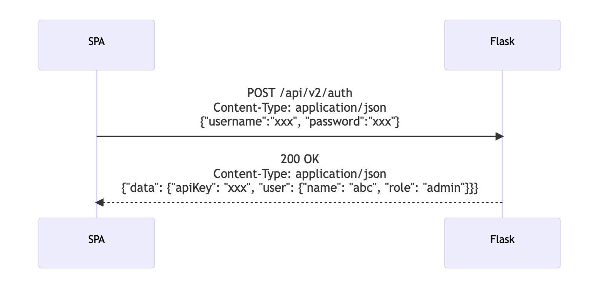
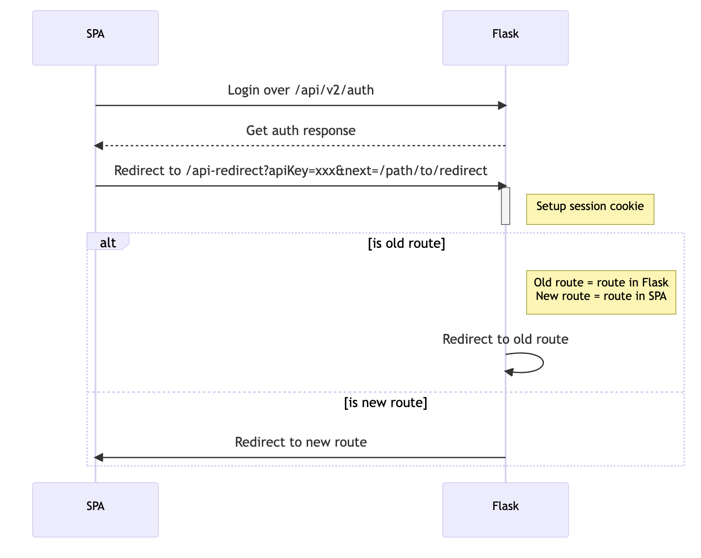
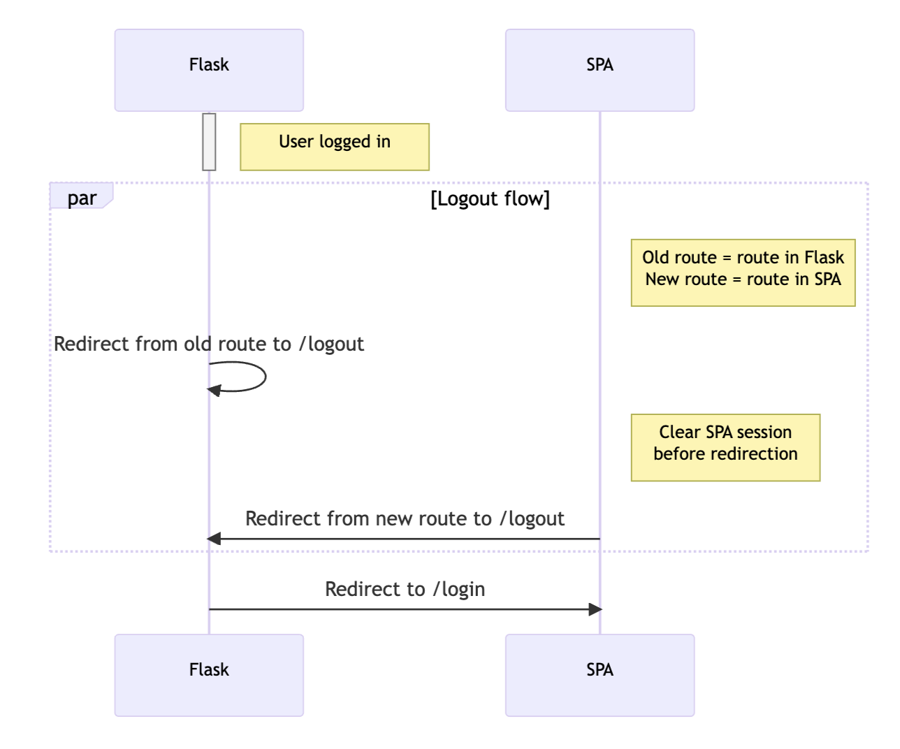
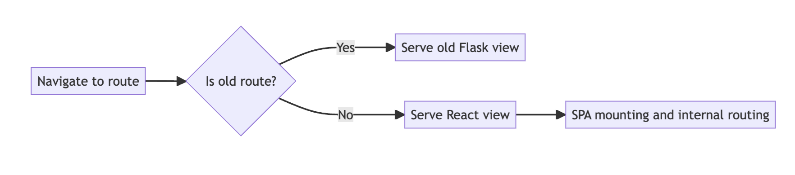

# Authentication

This page describes how authentication between the legacy Cryptosense front end platform and the Control Center React SPA is handled.

### api/v2/auth route for REST API authentication

Login route returns auth payload for the SPA to use:



Request payload:

```json
{
   "username": "xxx",
   "password": "xxx"
}
```

Response data:

```json
{
   "data": {
      "apiKey": "xxx",
      "user": {
         "name": "abc",
         "role": "xxx"
      }
   }
}
```

### Redirection route sets up auth cookie

To avoid all the issues regarding the HTTPOnly cookies, the possibility of setting cookie in regards to different browser approaches and the general simplicity of maintenance, we introduce a redirect route for the authorisation via apiKey (or token at a later point in time).

Login flow with SPA in the intermediary phase while we have both Flask app and SPA:




Redirect happens only once after login and will setup the session through cookie so that all of the old routes are still accessible.

After we transfer everything to SPA, this redirection route will be removed.

Logout flow:



### React view in Flask allows proxying

A React view can be used for SPA proxying through Flask during this intermediary phase.

Proxying is required since we will serve both SPA and Flask app from the same hostname and port.

Instead of defining rules at the reverse proxy level, during the intermediary phase where both SPA and Flask live together, we can use Flask as a proxy solution. This will give us more control over when we are replacing old routes with new routes. Additionally, we can deploy changes in the app without changing the reverse proxy side with each new addition which tends to be more flexible and simpler since the change is propagated with the code itself.

Moving from Flask handler to SPA handler:

```python
# Old route
bp.add_url_rule(
    "/organization/dashboard",
    view_func=OrganizationDashboardView.as_view("dashboard", current_user),
)

# New route
bp.add_url_rule(
    "/organization/dashboard",
    view_func=ReactIndexView.as_view("dashboard", current_user),
)
```

After the SPA is served, its internal routing will take over and render the proper page/component.

Navigation proxy:



The SPA code will be served from the provided path behind the env variable CONTROL_CENTER_BUILD_DIR. That way we have more leeway around how we build the SPA and where do we deploy it on server.

For this phase, we support only files on the same server.
